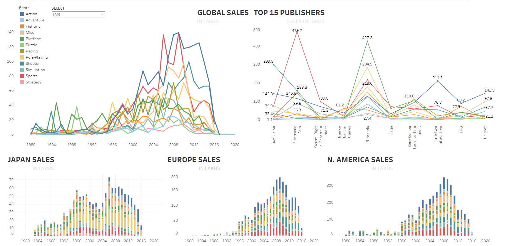

# 🎮 Global Video Game Sales Analysis (1980–2020)
Interactive Tableau dashboard analyzing global video game sales (1980–2020) by genre, publisher, and region, revealing market trends and top-performing titles.

## 📌 Overview
This project analyzes **global video game sales** from 1980 to 2020 across genres, publishers, and regions.  
The dashboard provides insights into market trends, top-selling publishers, and regional preferences using interactive visualizations.

---

## 📊 Dataset
- **Source:** [Kaggle – Video Game Sales Dataset](https://www.kaggle.com/datasets/gregorut/videogamesales)
- **Data Points:**  
  - Game Name  
  - Platform  
  - Year of Release  
  - Genre  
  - Publisher  
  - Regional Sales (North America, Europe, Japan, Others)  
  - Global Sales  

---

## 🛠 Tools & Technologies
- **Data Cleaning & Processing:** Python (pandas, numpy)  
- **Visualization:** Tableau Public  
- **Version Control:** GitHub  

---

## 📈 Key Insights
1. **Golden Era:** 2005–2010 saw the highest sales globally.  
2. **Top Genre:** Action games dominate global sales, followed by Sports and Shooter genres.  
3. **Top Publishers:**  
   - Electronic Arts (EA) – *479.7 lakh units*  
   - Nintendo – *427.2 lakh units*  
   - Activision – *299.9 lakh units*  
4. **Regional Preferences:**  
   - **Japan:** Prefers Role-Playing and Platform games.  
   - **Europe & N. America:** Strong inclination toward Action and Sports games.

---

## 📷 Dashboard Preview
  

---

## 🔗 Live Dashboard
[View on Tableau Public](https://public.tableau.com/app/profile/paras.saini7560/viz/salesdata_17501645232420/Dashboard1?publish=yes)

---

## 📂 Repository Structure

## Creator
Paras Saini
